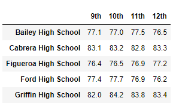
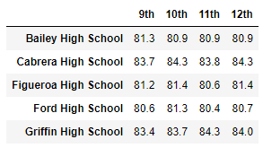

# School District Analysis
## Overview
The purpose of this analysis is to categorize the schools dataset to draw meaningful connections between school type, size, academic performance, and budget. These conclusions will help in the allocation of funds and overall understanding of socioeconomic factors and there effects on education. In this exercise, there was an instance of academic dishonesty among the ninth grade students at Thomas High School. We were tasked with removing their data entries from the analysis. 

## Results
* 
After Thomas High School ninth graders were removed, the passing math, reading, and overall percentages decreased.
* 
The row containing Thomas High School was updated after removing ninth grade scores. 
* ![Thomas High School][(Resources/thomas.PNG)
As displayed in the summary below, the removal of ninth graders at Thomas High School caused math, reading, and overall passing percentages to decrease. Logically, this makes sense given cheating usually results in a dishonest but numerically higher grade.
**Summary:**                 **Prior**      **with Thomas HS 9th Graders Removed**
% Passing Math                 93.3                        93.2
% Passing Reading              97.3                        97.0
% Overall Passing              90.9                        90.6
* 
*
* 
* 
* 
* 

