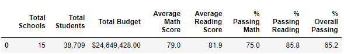
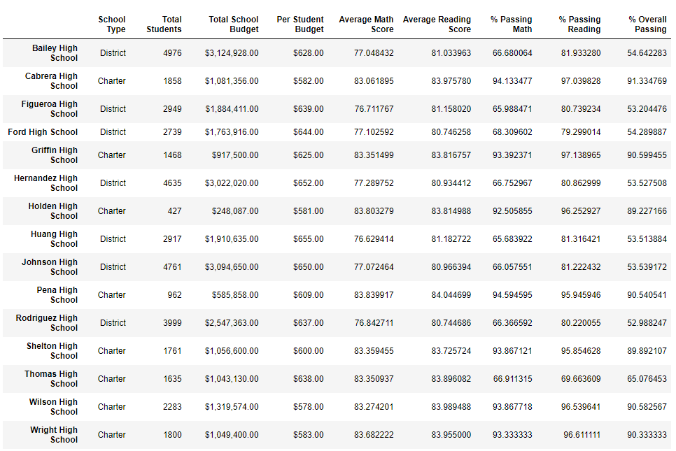
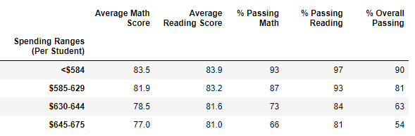
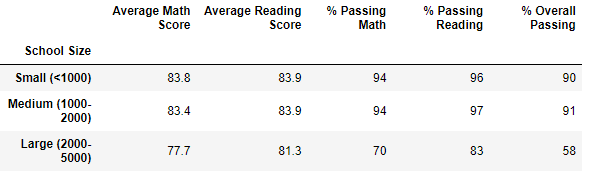
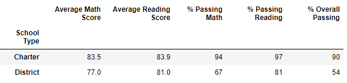

# School District Analysis
## Overview
The purpose of this analysis is to categorize the schools dataset to draw meaningful connections between school type, size, academic performance, and budget. These conclusions will help in the allocation of funds and overall understanding of socioeconomic factors and there effects on education. In this exercise, there was an instance of academic dishonesty among the ninth grade students at Thomas High School. We were tasked with removing their data entries from the analysis. 

## Results

### District Summary
After Thomas High School ninth graders were removed, the passing math, reading, and overall percentages decreased.

### School Summary
The row containing Thomas High School was updated after removing ninth grade scores. As displayed in the summary below, the removal of ninth graders at Thomas High School caused math, reading, and overall passing percentages to decrease. Logically, this makes sense given cheating usually results in a dishonest but numerically higher grade.

### Top 5 Schools
The top highest performing schools by overall passing percentage did not change with the removal of Thomas High School ninth grade scores.

### Bottom 5 Schools
Th lowest performing schools by overall passing percentage did not change with the removal of Thomas High School ninth grade scores.

### Math Scores by Grade
The math scores by grade displays a "nan" for the ninth graders of Thomas High School.

### Reading Scores by Grade
The reading scores by grade displays a "nan" for the ninth graders of Thomas High School.

### Spending per Student
This shows average reading and math scores and passing percentages bucketed by spending per student. The more spent per student does not equate to a better overall passing percentage. Thomas High School ninth graders had no noticable effect on this portion of the analysis.

### School Size
This displays the average reading and math scores and passing percentages bucketed by size of school. Small and medium size schools showed significantly better scores and passing percentages than large schools. Thomas High School ninth graders had no noticable effect on this portion of the analysis.

### School Type
School type is either District or Charter. Average reading and math scores and passing percentages are shown. Charter schools have better scores and percentages in every category than District schools. Charter scores are especially better in passing math percentage and alarmingly better in overall passing percentages than those of District schools. Removing Thomas High School ninth graders had no apparent effect on these metrics. 

## Summary
After a report of academic dishonesty, ninth grade students from Thomas High School were removed from this analysis. This impacted the Thomas High School student count, the percentage passing math, the percent passing reading, and the overall passing percentage of Thomas High School students. All of these metrics decreased as academic honesty usually is characterized by inflated scores. 

