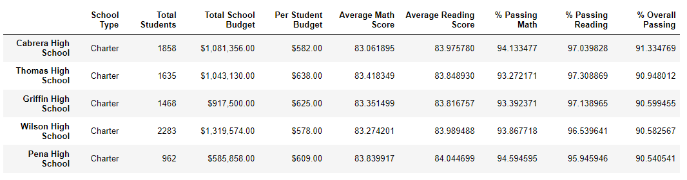
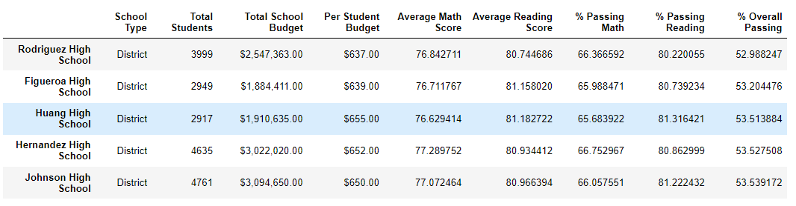

# School District Analysis
## Overview
The purpose of this analysis is to categorize the schools dataset to draw meaningful connections between school type, size, academic performance, and budget. These conclusions will help in the allocation of funds and overall understanding of socioeconomic factors and there effects on education. In this exercise, there was an instance of academic dishonesty among the ninth grade students at Thomas High School. We were tasked with removing their data entries from the analysis. 

## Results
### District Summary
After Thomas High School ninth graders were removed, the passing math, reading, and overall percentages decreased.

### School Summary
The row containing Thomas High School was updated after removing ninth grade scores.

### Thomas High School
As displayed in the summary below, the removal of ninth graders at Thomas High School caused math, reading, and overall passing percentages to decrease. Logically, this makes sense given cheating usually results in a dishonest but numerically higher grade.
![Thomas High School][(Resources/thomas.PNG)

### Top 5 Schools
The top highest performing schools by overall passing percentage did not change with the removal of Thomas High School ninth grade scores.

### Bottom 5 Schools
Th lowest performing schools by overall passing percentage did not change with the removal of Thomas High School ninth grade scores.

### Math Scores by Grade
The math scores by grade displays a "nan" for the ninth graders of Thomas High School.

### Reading Scores by Grade
The reading scores by grade displays a "nan" for the ninth graders of Thomas High School.

### Spending per Student

### School Size

### School Type

